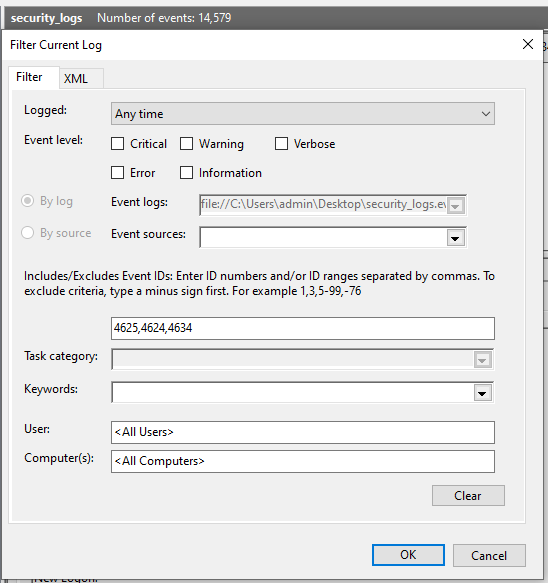
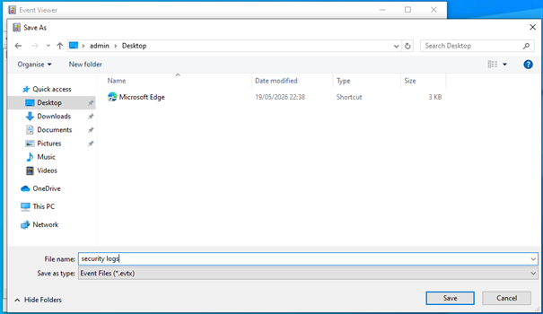
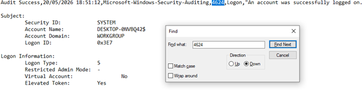
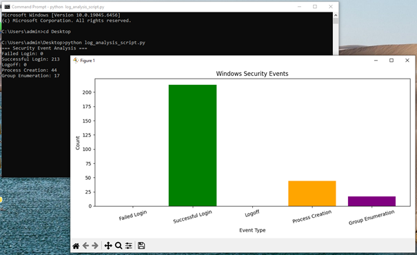

# windows-security-log-analysis
Windows Security Event Log analysis project using Python for authentication monitoring and basic threat detection.

# Windows Security Log Analysis

## 📌 Project Overview
This project analyzes Windows Security Event Logs using Python to detect failed login attempts, authentication activity, and suspicious security events.

## 🛠️ Technologies Used
- Windows 10
- Python
- Pandas
- Matplotlib
- PowerShell
- Windows Event Viewer

## 🔍 Features
- Failed login detection
- Successful login monitoring
- Security event analysis
- Data visualization
- Basic brute-force detection

## 📊 Analyzed Event IDs

| Event ID | Description |
|---|---|
| 4625 | Failed Login |
| 4624 | Successful Login |
| 4634 | Logoff |
| 4688 | Process Creation |
| 4798 | Group Enumeration |

## 🚀 How to Run

Install dependencies:

```bash
pip install pandas matplotlib
```

Run the script:

```bash
python log_analysis_script.py
```

## 📸 Screenshots

### Event Analysis




### Visualization


## 🧠 Skills Demonstrated
- Windows log analysis
- Security monitoring
- Python scripting
- Threat detection basics
- SOC analyst fundamentals
